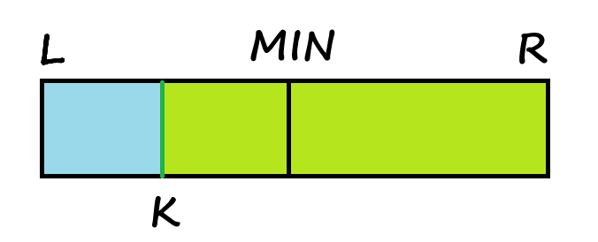
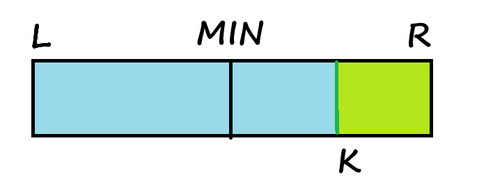

# [问题](https://leetcode.cn/problems/search-in-rotated-sorted-array/description/?envType=problem-list-v2&envId=binary-search)

整数数组 `nums` 按升序排列，数组中的值 **互不相同** 。

在传递给函数之前，`nums` 在预先未知的某个下标 `k`（`0 <= k < nums.length`）上进行了  **旋转** ，使数组变为 `[nums[k], nums[k+1], ..., nums[n-1], nums[0], nums[1], ..., nums[k-1]]`（下标 **从 0 开始** 计数）。例如， `[0,1,2,4,5,6,7]` 在下标 `3` 处经旋转后可能变为 `[4,5,6,7,0,1,2]` 。

给你 **旋转后** 的数组 `nums` 和一个整数 `target` ，如果 `nums` 中存在这个目标值 `target` ，则返回它的下标，否则返回 `-1` 。

你必须设计一个时间复杂度为 `O(log n)` 的算法解决此问题。

# 题解

注意，这里的 k 与题目不同，指的是原数组 nums[0] 出现的位置。

首先，min 的位置分为两种情况。

第一种，min 位于 k 的右边（ min < l ）。

1> min 所在位置的值等于 target ，返回 min

2> min 所在位置的值大于 target ，那么 target 存在于 [ k, min-1 ]，然而我们无法确定 k 的位置，所以我们对整个左边进行搜索。

3> min 所在位置的值小于 target ，那么 target 存在于 [ l,k ]U[ min+1,r ]，此时左右两边都可能存在有效数据，需要继续找条件。

* target >= l 所在位置的值，那么 target 存在于 [ l,k ]，然而我们无法确定 k 的位置，所以我们对整个左边进行搜索。
* target < l 所在位置的值，那么 target 存在于 [ min+1,r ] ，对整个右边进行搜索。

基于 2> 和 3> 简化逻辑，target > nums[min] && target < nums[l] 时搜索右边，否则搜索左边。



第二种，min 位于 k 的左边（ min > l ）。

1> min 所在位置的值等于 target ，返回 min

2> min 所在位置的值大于 target ，那么 target 存在于 [ l, min-1 ]U[ k,r ]，此时左右两边都可能存在有效数据，需要继续找条件。

* target >= l 所在位置的值，那么 target 存在于 [ l,min-1 ]，对整个左边进行搜索。
* target < l 所在位置的值，那么 target 存在于 [ k,r ] ，然而我们无法确定 k 的位置，所以我们对整个右边进行搜索。

3> min 所在位置的值小于 target ，那么 target 存在于 [ min+1,k ]，然而我们无法确定 k 的位置，所以我们对整个右边进行搜索。

基于 2> 和 3> 简化逻辑，target < nums[min] && target >= nums[l] 时搜索左边，否则搜索右边。



min 与 k 位置重合时符合情况二判断的结果。

# 代码

首次成功提交：

```
func search(nums []int, target int) int {
    var l,r,min int
    l = 0
    r = len(nums) - 1
    if r<1 {
        if nums[0] == target{ return 0 }
        return -1
    }
    for l <= r {
        min = l + (r - l)>>1
        if nums[min] == target { return min }
        if nums[min] == nums[l] {
            if nums[r] == target { return r }
            return -1
        }
        if nums[min] < nums[l] {
            if nums[min] > target {
                r = min - 1
            }else{
                if nums[l] == target { return l }
                if nums[l] < target {
                    r = min - 1
                }else{
                    l = min + 1
                }
            }
        }else{
            if nums[min] < target {
                l = min + 1
            }else{
                if nums[l] == target { return l }
                if nums[l] < target {
                    r = min - 1

                }else{
                    l = min + 1
                }
            }
        }
    }
    return -1
}
```

逻辑简化后：

```
func search(nums []int, target int) int {
    var min int
    l := 0
    r := len(nums) - 1
    if r<1 {
        if nums[0] == target{ return 0 }
        return -1
    }
    for l <= r {
        min = l + (r - l)>>1
        if nums[min] == target { return min }
        if nums[min] < nums[l] {
            if target > nums[min] && target < nums[l] {
                l = min + 1
            }else{
                r = min -1
            }
        }else{
            if target < nums[min] && target >= nums[l] {
                r = min - 1
            }else{
                l = min + 1
            }
        }
    }
    return -1
}
```
