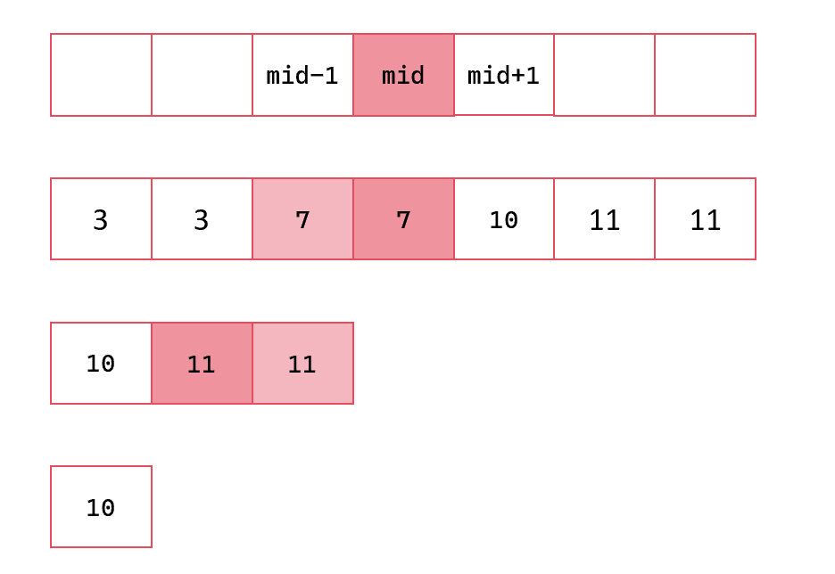
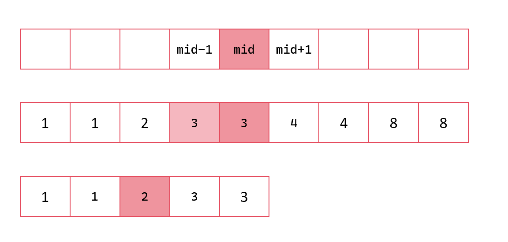

# [问题](https://leetcode.cn/problems/single-element-in-a-sorted-array/solutions/2983333/er-fen-xing-zhi-fen-xi-jian-ji-xie-fa-py-0rng/?envType=daily-question&envId=2025-04-08)

给你一个仅由整数组成的有序数组，其中每个元素都会出现两次，唯有一个数只会出现一次。

请你找出并返回只出现一次的那个数。

你设计的解决方案必须满足 `O(log n)` 时间复杂度和 `O(1)` 空间复杂度

# 题解

分析易有：数组元素为2n+1个。分为两个子数组后，元素奇数个的数组就是需要进一步二分的。

二分数组，将中间值独立观察，最后再并入某一个子数组。

两个子数组的元素个数如果是奇数：

* `[mid-1]`与 `[mid]`相同，继续二分 `[mid+1,right]`
* `[mid+1]`与 `[mid]`相同，继续二分 `[left,mid-1]`
* 都不相同返回 `[mid]`



两个子数组的元素个数如果是偶数：

* `[mid-1]`与 `[mid]`相同，继续二分 ` [left,mid]`
* `[mid+1]`与 `[mid]`相同，继续二分 ` [mid,right]`
* 都不相同返回 `[mid]`



# 代码

```
func singleNonDuplicate(nums []int) int {
    if len(nums) < 2 {
        return nums[0]
    }
    left := 0
    right := len(nums) - 1
    for{
        mid := (left + right) / 2
        if left == right {
            return nums[mid]
        }
        yu := mid % 2
        if yu != 0 {
            if nums[mid] == nums[mid - 1]{
                left = mid + 1
                continue
            }else if nums[mid] == nums[mid + 1]{
                right = mid - 1
                continue
            }else{
                return nums[mid]
            }
        }else{ 
            if nums[mid] == nums[mid - 1]{
                right = mid
                continue
            }else if nums[mid] == nums[mid + 1]{
                left = mid
                continue
            }else{
                return nums[mid]
            }
        }
    }
}
```
