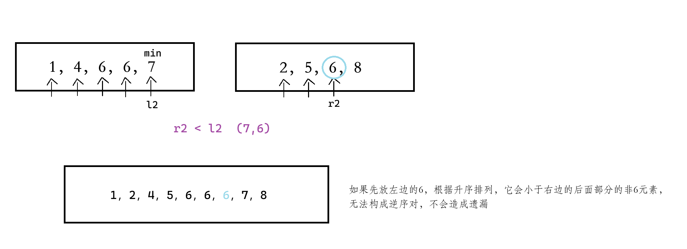

# [问题](https://leetcode.cn/problems/shu-zu-zhong-de-ni-xu-dui-lcof/description/)

在股票交易中，如果前一天的股价高于后一天的股价，则可以认为存在一个「交易逆序对」。请设计一个程序，输入一段时间内的股票交易记录 `record`，返回其中存在的「交易逆序对」总数。

# 题解

为什么选择归并排序：

与左右顺序有关，与数的大小比较有关。

以下图中的 min 是二分的中间值，原为 mid，此处笔误。

怎么进行逆序对的计数：


左右两边相同时哪个先进入数组：




容易忽视的条件：

```
输入：[]
此时传入的 r = -1,所以递归结束条件不能是 l==r ，而改为 l<=r
```

影响执行用时的条件：

提前分配，相对于在 q1 函数中分配切片（ 每次调用 q1 都会分配一次 ），减少了创建底层数组的操作。

预分配了切片的容量，这使得后续的 append 操作无需频繁扩容底层数组，减少了内存分配次数。

为什么切片自动归为空切片：


# 代码

```
func reversePairs(record []int) int {
	help := make([]int, 0, len(record))
	return Q1(record, help, 0, len(record)-1)
}
func Q1(arr, help []int, l, r int) int {
	if l >= r {
		return 0
	}
	mid := l + (r-l)>>1
	num := Q1(arr, help, l, mid) + Q1(arr, help, mid+1, r)
	return num + q1(arr, help, l, mid, r)
}
func q1(arr, help []int, l, m, r int) int {
	l2, r2, num := l, m+1, 0
	for l2 <= m && r2 <= r {
		if arr[l2] <= arr[r2] {
			help = append(help, arr[l2])
			l2++
		} else {
			help = append(help, arr[r2])
			num += m - l2 + 1
			r2++
		}
	}
	if l2 > m {
		help = append(help, arr[r2:r+1]...)
	}
	if r2 > r {
		help = append(help, arr[l2:m+1]...)
	}
	for i := 0; i < r-l+1; i++ {
		arr[l+i] = help[i]
	}
	return num
}
```
